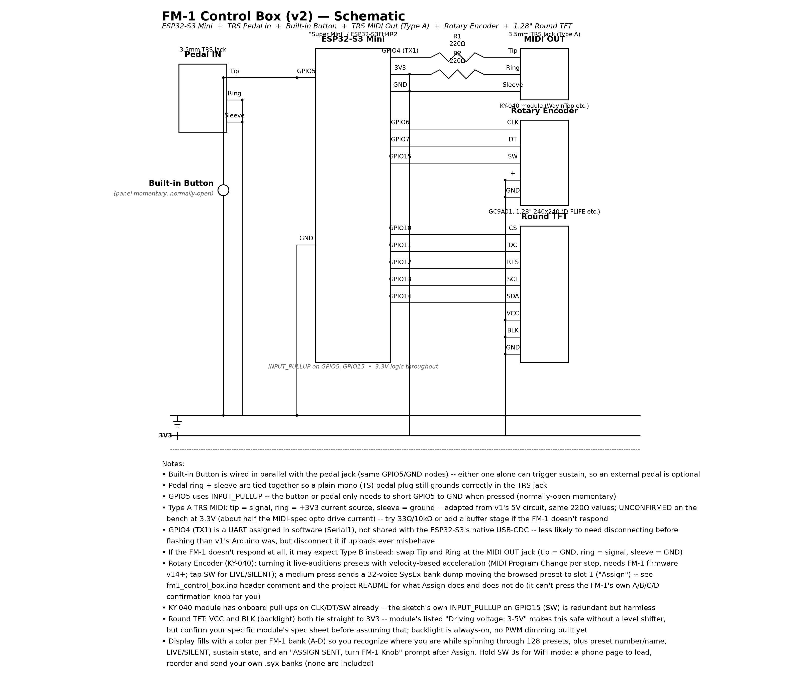
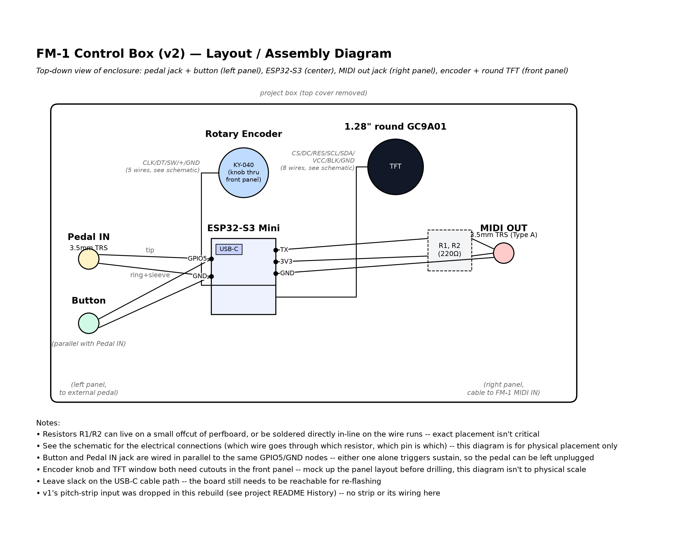

# FM-1 Bonus Box

A small companion board for the [M-VAVE FM-1](https://www.m-vave.com/products), talking to it over its 3.5mm TRS MIDI IN. Started as a sustain-pedal-to-CC64 converter on a spare Arduino Uno R3 (**v1**, below); as of 2026-09-22 it's being rebuilt around an **ESP32-S3 Mini** (**v2**, current) to add live preset browsing, a one-button way to set the FM-1's boot sound, and standalone soundbank management over WiFi — in the same small enclosure. **No soundbanks are included in this repo** — you bring your own DX7 `.syx` files. Also includes [`fm1_soundbank_app`](fm1_soundbank_app/), a computer-side CLI for listing, reordering, and sending a 128-preset soundbank to the FM-1 over USB MIDI — useful on its own even without building the box.

## v2 — ESP32-S3 Control Box (current)

Same sustain-pedal/button job as v1, plus:

- A rotary encoder (KY-040, with a built-in pushbutton) browses the FM-1's 128 presets, with **velocity-based acceleration** — spin fast to cover ground, slow down for single-step precision (see the `ACCEL_TABLE` in the sketch). In LIVE mode every step sends a MIDI Program Change, so you hear the change live — same as turning the FM-1's own PRESETS knob.
- **Tap the encoder to toggle LIVE / SILENT.** SILENT stops sending Program Changes, so you can browse for an Assign target mid-performance without the FM-1's sound changing; the screen shows which preset is still playing. Going back to LIVE snaps to that playing preset.
- A 1.28" round GC9A01 color TFT (240x240, SPI) shows the browsed preset number and name, which bank (A-D) it's in (the background color changes per bank), LIVE/SILENT, and sustain state.
- **A medium press (release between 400ms-3s) "Assigns"** the browsed preset to slot 1 of its bank. The FM-1 always powers on at whatever's in slot 001 (there's no separate boot-preset preference — confirmed by checking the manual's Global settings end to end and by testing directly on the device), so Assigning something from bank A is how you set the boot sound from the box itself.
- **A long press (3s+) opens WiFi mode**: the box becomes its own WiFi access point serving a soundbank page, where you find `.syx` files on your phone/laptop, load them into the box, drag-and-drop to reorder (multi-select supported), save, and send the result to the FM-1. No computer software needed after the box itself is flashed.

**Compiles clean** against `esp32:esp32:esp32s3` (77% flash / 24% RAM) as of 2026-09-23. **Not yet built or bench-tested** — no physical board yet. The web page was exercised in a desktop browser against a stand-in for the box's API (find/load/multi-select drag/save/send all worked); it hasn't run on the ESP32 or a phone yet. **Requires a partition scheme with LittleFS/SPIFFS** (Tools > Partition Scheme, e.g. "Default 4MB with spiffs") for the box's bank to survive a power cycle.

### Bring your own soundbanks

**No voice data ships with this repo or the firmware.** The FM-1's own factory set, Yamaha's ROM/VRC cartridges, and commercial banks aren't openly licensed, so none are included; `.syx` files are gitignored. The box starts with an empty bank and holds only what you load into it. Good sources are listed on the box's page ("Where to get banks"); for the FM-1's own factory set see [KingParamount/fm1-factory-presets](https://github.com/KingParamount/fm1-factory-presets).

**The FM-1 can't be asked what it currently has loaded.** It only receives SysEx voice data over MIDI — it never transmits its own voices back, to this box, to a computer, or to anything else. That's how the hardware/firmware is built, not a software limitation. So the box keeps its own copy of the bank (what you've loaded and arranged), and Assign/Send push from that copy. If you care about what's on your FM-1 right now, make sure you have it as `.syx` files *before* sending anything over it — there's no way to pull it back off the device afterward. (Different units don't all have the same content either: this project's own unit booted with BRASS at slot 1, not the recovered factory set's PIANO 1.)

### Controls

| Action | Result |
|---|---|
| Turn encoder | Browse presets (accelerates with speed); in LIVE mode also sends a MIDI Program Change |
| Tap, release < 400ms | Toggle LIVE ↔ SILENT browse. SILENT = browse/Assign without changing the FM-1's sound; screen shows what's still playing. Back to LIVE snaps to the playing preset |
| Medium press, release 400ms-3s | Assign browsed preset to slot 1 of its bank |
| Long press, release ≥ 3s | Toggle WiFi mode on/off |
| Pedal / built-in button | Sustain (CC64) |

The screen shows a live hint ("release: ASSIGN" / "release: WIFI MODE") once you've held past each threshold, so you don't have to count seconds.

### The soundbank page (WiFi mode)

1. Hold the encoder button 3+ seconds. The box becomes a WiFi access point: SSID `FM1-ControlBox`, password `fm1setup1` (change both in the sketch before relying on this outside a trusted room — it's a local WPA2 access point, not meant to be internet-facing).
2. Connect a phone or laptop to that network, browse to `http://192.168.4.1`. The page shows the box's current 128-slot bank.
3. **Find sound banks…** opens the device's file picker (pick several at once). Each standard DX7 32-voice bulk dump found in the files is listed with its voice names; files that aren't one are rejected. The box's network has no internet, so download banks beforehand.
4. **Load sound bank**: pick one of the found banks and a target (Bank A/B/C/D = presets 001-032/033-064/065-096/097-128). Replacing a bank that already has voices asks for a second press.
5. **Arrange**: tap voices to select several (shift-click for a range on a computer), then drag any selected one by its ≡ handle — they move together, keeping their order, anywhere across all 128 slots (the page auto-scrolls near the edges). "Empty selected slots" clears slots.
6. **Save to box** stores the bank in the ESP32's flash (LittleFS). **Send to FM-1…** saves if needed, then sends each *complete* bank (all 32 slots filled) one at a time, telling you which FM-1 knob to turn to confirm each one before you press Next. Banks with empty slots are skipped.
7. Hold the encoder 3+ seconds again to close WiFi mode.

The bank survives power cycles and reflashing the sketch (reflashing the filesystem partition itself would wipe it; ordinary sketch uploads won't). All `.syx` parsing and reordering happens in the browser; the box just stores the 16KB result (`GET /bank.bin`, `POST /bank`) and sends banks over MIDI (`POST /send?q=0-3`).

### Schematic and layout

| Schematic | Physical layout |
|---|---|
| [](schematics/fm1_control_box_schematic.pdf) | [](schematics/fm1_control_box_layout.pdf) |

PDFs (linked above) are the high-res versions. `schematics/generate_fm1_control_box_schematic.py` regenerates both from source (matplotlib; `pip install matplotlib` first).

### What "Assign" and "Send" actually do, and their real limits

Both work from the box's own stored bank — never a read-modify-write of the real device, which can't be read (see "Bring your own soundbanks").

- A DX7 bank dump is always 32 voices, so both rewrite **all 32 presets** in a bank (001-032, 033-064, 065-096, or 097-128). Assign moves your chosen preset to slot 1 of its bank (the ones before it shift down one), saves that change to the box's own bank so it keeps matching the FM-1, and sends the bank. Anything on the real FM-1 in that range gets overwritten with the box's copy.
- Neither will send a bank that still has empty slots.
- After each dump **the FM-1 shows its own A/B/C/D bank-slot picker** and needs a physical knob turn on the FM-1 itself (Knob 1 for A, 2 for B, …) to commit. The box/page prompts you but can't press that knob — confirmed this step is required when doing it from a computer.

### Parts

- ESP32-S3 Mini ("Super Mini", ESP32-S3FH4R2 — 3.3V logic, unlike the Uno's 5V)
- [WayinTop 360-degree rotary encoder module](https://www.amazon.com/dp/B07T3672VK) (KY-040, 5-pin breakout)
- [1.28" round GC9A01 color TFT](https://www.amazon.com/dp/B0C1G92F2B) (e.g. D-FLIFE, 240x240, 4-wire SPI) — same part + library already proven in this project's [fm1-midi-voice-tuner](https://github.com/pfkellogg/fm1-midi-voice-tuner)
- 1/8" (3.5mm) TRS panel-mount jack, wired to the sustain pedal (reused from v1)
- 1/8" (3.5mm) TRS panel-mount jack, for MIDI out (reused from v1)
- Momentary panel pushbutton (normally-open SPST), for sustain with no pedal plugged in (reused from v1)
- 2x 220ohm resistors (MIDI out circuit)
- 3.5mm TRS-to-TRS cable, to reach the FM-1's MIDI IN

### Hardware

MCU: **ESP32-S3 Mini** ("Super Mini", ESP32-S3FH4R2 — 3.3V logic, unlike the Uno's 5V).

Pin map (avoid ESP32-S3's strapping pins 0/3/45/46):

| Pin | Function |
|---|---|
| GPIO4 | MIDI OUT (UART1 TX, through 220ohm to TRS tip) |
| GPIO5 | Sustain pedal/button (`INPUT_PULLUP`) — same node design as v1 |
| GPIO6 | Encoder CLK |
| GPIO7 | Encoder DT |
| GPIO15 | Encoder SW (pushbutton, `INPUT_PULLUP`) |
| GPIO10 | TFT CS |
| GPIO11 | TFT DC |
| GPIO12 | TFT RES (reset) |
| GPIO13 | TFT SCL (SPI clock) |
| GPIO14 | TFT SDA (SPI MOSI) |

TFT's `VCC` and `BLK` (backlight) both tie straight to 3V3 — no GPIO needed, backlight always-on (no PWM dimming built yet), same choice already proven on this exact display in fm1-midi-voice-tuner.

**MIDI OUT (TRS, Type A — same convention as v1):**
```
GPIO4 (TX) -> 220ohm -> TRS tip
3V3        -> 220ohm -> TRS ring
GND        ->          TRS sleeve
```
v1 drove this from 5V; at 3.3V the opto in the FM-1's MIDI IN gets less drive current (~2.5mA vs. the MIDI-spec 5mA). Widely reported to still work fine with modern high-gain optos, but **this needs bench confirmation** before trusting it — if the FM-1 doesn't respond, try 33ohm/10ohm in place of the 220ohm pair, or add a transistor/inverter buffer stage.

**Sustain pedal/button:** identical wiring to v1's D2 node (see below), just on GPIO5 instead.

**Encoder:** [WayinTop 360-degree rotary encoder module](https://www.amazon.com/dp/B07T3672VK) (KY-040 — 5-pin breakout, onboard pull-ups, 20 detents/revolution). `+` to 3V3, `GND` to GND, `CLK`/`DT`/`SW` to GPIO6/7/15.

**Round TFT (1.28" GC9A01, SPI):** [D-FLIFE or similar](https://www.amazon.com/dp/B0C1G92F2B) — `CS`/`DC`/`RES`/`SCL`/`SDA` to GPIO10/11/12/13/14, `VCC` and `BLK` both to 3V3, `GND` to GND. Listed "Driving voltage: 3-5V" on the linked module, so wiring straight to 3V3 is safe without a level shifter — **confirm your specific module's spec sheet matches** before assuming that; some bare GC9A01 panels floating around are 3.3V-only or need a level shifter, per the same caution already noted in fm1-midi-voice-tuner's README.

**Live browsing needs FM-1 firmware v14+.** Program Change support for preset selection was added to the FM-1 in firmware v14 — on older firmware the encoder's live-audition (turn = hear the change) won't do anything, though Assign (which sends a SysEx bank dump, not Program Change) doesn't depend on this and should still work. Check/update firmware via M-VAVE's tool if browsing seems dead.

### Firmware

`fm1_control_box/fm1_control_box.ino`. Libraries (Library Manager): `Adafruit GC9A01A` + `Adafruit GFX Library` + `Adafruit BusIO`, `ESP32Encoder` (madhephaestus). `WiFi`, `WebServer`, and `LittleFS` are part of the `esp32` core itself, nothing extra to install. Board: `esp32` core (Espressif), profile `ESP32S3 Dev Module` (`esp32:esp32:esp32s3`) unless your specific Super Mini clone publishes its own board profile — **and a Partition Scheme that includes LittleFS/SPIFFS** (Tools menu), or the box's bank silently falls back to RAM-only (works until power-off, then starts empty again).

**Encoder scaling is untuned** — `STEPS_PER_DETENT` in the sketch is set to 1, but KY-040/EC11 modules commonly report 2 raw quadrature counts per physical detent with `attachHalfQuad()` depending on the exact module/library version. First thing to check on the bench: turn the knob exactly one detent (slowly, well outside the acceleration thresholds) and confirm the display's preset number moved by exactly 1. If it jumps by 2 (or 4), raise `STEPS_PER_DETENT` to match.

**Encoder acceleration is likewise untuned** — the `ACCEL_TABLE` thresholds (80/150/300ms between steps → 8/4/2/1 presets per step) are a starting guess, not bench-measured. Adjust to taste once you can actually feel how fast a real spin registers.

`web_page.h` holds the WiFi-mode page (HTML/CSS/JS in one PROGMEM string).

**WiFi mode is untested on real hardware.** The page's logic (file parsing, load, multi-select drag, save, send sequence) was checked in desktop Chrome against a Python stand-in for the box's three endpoints, but not yet on the ESP32's `WebServer` (in particular the 16KB multipart upload) or on a phone's touch drag. Test with banks you have other copies of first.

### Flashing

USB-C into the ESP32-S3 Mini for both power and flashing. **Disconnect the MIDI TX line (GPIO4) before uploading** if it's wired up — same class of gotcha as v1's Arduino, though the ESP32-S3's native USB-CDC serial is less likely to collide with GPIO4 than the Uno's shared pins 0/1 were.

---

## v1 — Arduino Uno, sustain only (superseded by v2, kept for reference)

Confirmed working end-to-end 2026-08: physical pedal → Arduino → TRS MIDI (Type A) → FM-1 sustain. `fm1_sustain_footswitch.ino` at the repo root is this version; superseded by `fm1_control_box/` above but left in place/working as a simpler fallback if the ESP32-S3 build isn't wanted.

### Schematic and layout

| Schematic | Physical layout |
|---|---|
| [](schematics/fm1_footswitch_schematic.pdf) | [](schematics/fm1_footswitch_layout.pdf) |

PDFs (linked above) are the high-res versions. `schematics/generate_fm1_footswitch_schematic.py` regenerates both from source (matplotlib; `pip install matplotlib` first). This is v1's Arduino Uno wiring — see v2 above for the current ESP32-S3 diagrams.

### Parts

- Arduino Uno R3
- 1/8" (3.5mm) TRS panel-mount jack, wired to the sustain pedal
- 1/8" (3.5mm) TRS panel-mount jack, for MIDI out
- Momentary panel pushbutton (normally-open SPST), for sustain with no pedal plugged in
- 2x 220ohm resistors (MIDI out circuit)
- 3.5mm TRS-to-TRS cable, to reach the FM-1's MIDI IN

### Wiring

**Pedal input (TRS jack):**
```
pedal jack tip           -> Arduino D2
pedal jack ring + sleeve -> Arduino GND (tied together)
```
D2 is `INPUT_PULLUP`, so the pedal just needs to short tip to ring/sleeve when pressed. Ring and sleeve are tied together so a plain mono (TS) pedal plug still grounds correctly when inserted into the TRS jack. This covers the vast majority of 1/8" sustain pedals (simple momentary SPST, normally open).

**Built-in button (optional, for no pedal):**
```
button leg 1 -> Arduino D2   (same node as pedal jack tip)
button leg 2 -> Arduino GND  (same node as pedal jack ring/sleeve)
```
Wired straight in parallel with the pedal jack — no separate pin, no code changes. Either the button or the pedal alone can pull D2 low, so pressing the button works whether or not a pedal is plugged in. If a pedal *is* plugged in and its footswitch is a normally-closed momentary (rare), it'll hold D2 low all the time, which would also hold the panel button's effect at "always on" — not an issue for the standard normally-open pedals this is designed for.

**MIDI output (direct to TRS, Type A):**
```
Arduino TX (pin 1) -> 220ohm resistor -> TRS jack tip
Arduino 5V         -> 220ohm resistor -> TRS jack ring
Arduino GND        -> TRS jack sleeve
```
Then a plain 3.5mm TRS-to-TRS cable into the FM-1's MIDI IN.

### Flashing

Upload `fm1_sustain_footswitch.ino` as usual. **Disconnect the TRS output jack (or at least the TX line) from the Arduino before uploading** — pins 0/1 are shared with the USB serial the IDE uses to program the board, and the resistor circuit sitting on TX can interfere with the upload.

### If it comes up backwards

Two independent polarity unknowns here, each with a one-line fix — don't chase the other one first:

- **Pedal polarity** (sustain reads "on" at idle, "off" when pressed): flip `kInvert` to `true` in the sketch and re-upload.
- **TRS MIDI type** (FM-1 doesn't respond at all): this board is wired Type A (tip = signal, ring = +5V, sleeve = GND). If the FM-1 turns out to expect Type B, swap tip and ring at the jack (or re-wire): tip = GND, ring = signal, sleeve = GND. Applies to v2 as well.

## History

A pitch-strip input (linear softpot) was planned for v1 but never got past "part not sourced" before the ESP32-S3 rebuild started — dropped rather than ported to v2 for now; revisit if wanted later.

An OLED display, a mode switch (to flip the OLED between sustain status and a live pitch readout), and an audio-input pitch detector (reading the FM-1's own headphone output) all previously lived on an earlier version of this board. All three were removed 2026-08-09 — the OLED moved permanently to a separate project, [fm1-midi-voice-tuner](https://github.com/pfkellogg/fm1-midi-voice-tuner), which reads the FM-1's MIDI output instead of its audio output. See git history on this repo if the mode switch or audio pitch detector are ever needed again. (v2's round TFT, above, is a new, unrelated addition built for preset browsing, not a return of this one.)

## Files

```
fm1_control_box/                       v2 — ESP32-S3 firmware
  fm1_control_box.ino
  web_page.h                           the WiFi-mode soundbank page
fm1_sustain_footswitch.ino             v1 — Arduino Uno firmware
fm1_soundbank_app/                     computer-side CLI: list/reorder/send a soundbank over USB MIDI
  fm1_soundbank.py
  README.md                            its own docs — boot-patch findings, usage
  banks/                               (gitignored) your 4 .syx files go here
  reference/presets_provenance.json    where each FM-1 factory voice came from (names/sources only, no voice data)
schematics/
  generate_fm1_control_box_schematic.py / fm1_control_box_*.{pdf,png,svg}   v2 diagrams
  generate_fm1_footswitch_schematic.py / fm1_footswitch_*.{pdf,png,svg}     v1 diagrams
```

`fm1_soundbank_app/reference/presets_provenance.json` was generated from [KingParamount/fm1-factory-presets](https://github.com/KingParamount/fm1-factory-presets)' `docs/protocol-and-provenance.md` (CC BY-SA 4.0) and is shared under the same license. It contains names and sourcing notes only, no voice parameters.
